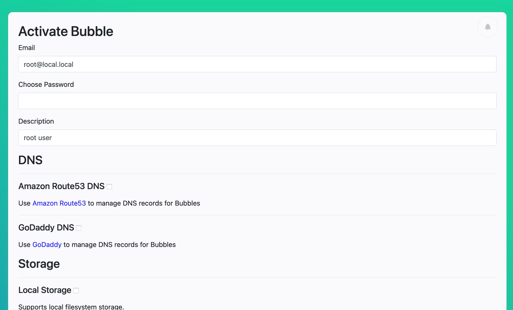

Bubble Activation
=================
The very first time Bubble runs it has a blank database, nothing has been defined.

If you load the Bubble webapp, you'll see a screen like this one:

#### Activation Screen
 

This is a Bubble that is awaiting activation.

Activation defines the initial data required to run a Bubble launcher. This includes the initial admin password,
cloud services, and DNS domains.

## Cloud Accounts
In order to activate your Local Launcher, you'll need accounts and/or API keys from several cloud providers.

Have these account credentials handy. Be prepared to sign up for new accounts where needed.

## Activate via Web UI
The browser-based admin UI should be displaying an "Activate" page, like the one shown above.

Review the "Activation Notes" below, then complete the information on this page and press the "Activate" button
to activate your Bubble Launcher. 

## Activate via command line
If you installed Bubble from a [binary distribution](run-binary.md) or built it [from source](dev.md),
you can also perform activation using the Bubble command line tools.

Make a copy of the [config/activation.json](https://git.bubblev.org/bubblev/bubble/raw/branch/master/config/activation.json)
file and edit the copy. There are comments in the file to guide you.

To activate your Local Launcher Bubble, run this command:

    ./bin/bactivate /path/to/activation.json

## Activation Notes

### Admin Email
For the initial admin user, choose an email address that only you have access to. Otherwise someone else
with access to that email could change your password and lock you out of your account. 

### Required Clouds
You must define at least one cloud provider for each of these categories:
  * DNS (Amazon Route53 or GoDaddy DNS)
  * Email (SMTP, SendGrid or Mailgun)
  * Compute (Vultr or DigitalOcean)
    * Note: Amazon EC2 support is incomplete, do not use for now

### Initial Domain
The initial Domain you define during activation must be owned by you.
 * For web-based activation, this is the `Domain Name` field near the bottom.
 * For JSON-based activation, this is the `domain.name` JSON element.

The DNS provider for this domain must be specified.
 * For web-based activation, this is the `DNS for this Domain` field at the bottom.
 * For JSON-based activation, this is the `domain.publicDns` JSON element.

## Behind the Scenes
In the background, the Bubble launcher is building packer images for the compute cloud(s) defined during activation.

This process usually takes about 20 minutes but can take up to an hour, depending on how many compute clouds you have
and how fast the internet is.

If you try to launch a Bubble before the required packer image is ready, your Bubble launcher will detect that the image
is in the process of being built, and wait until it is ready before trying to use the image.

[Learn more about Packer images](packer.md).

## Sign In to Admin Account
After performing activation, refresh the web page that opened when the server started. You should see a login page.

You can now login as the admin user using the email address and password you set during activation.

## Launch Time
Activation is complete! Ready to [launch a Bubble](launch-node.md)?
