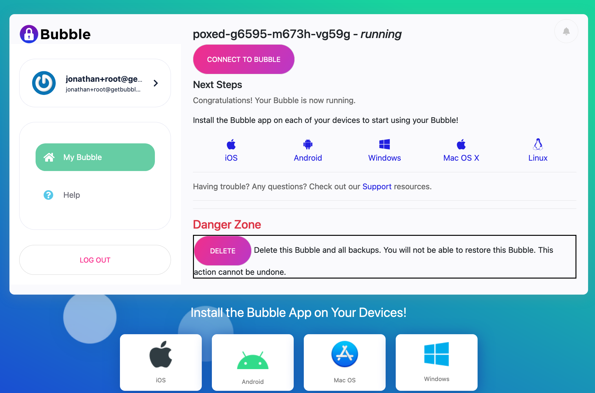

Launching a Bubble from a Local Launcher
========================================
These instructions assume you have already set up a [Local Launcher](local-launcher.md)
or are running the [Bubble Docker Launcher](docker-launcher.md).

## Login
Open a browser window to your Local Launcher. You should see a screen like this one:

#### Sign In Screen
  

Login to your Local Launcher using the root admin account that was created during activation.

## Launch Bubble
You should see a "Launch Bubble" screen, like the one below:

#### Launch Bubble Screen
  

Click the "Launch with Advanced Settings" link below the `LAUNCH BUBBLE` button.
You should now see the advanced launch settings screen, like the one below:

#### Launch Settings Screen
  

In the "Bubble Type" drop-down, ensure that "Fork Bubble" is selected.

If you leave the "Fork Host" field blank, the system will assign a hostname for you.
Or, you set the "Fork Host" to be the fully-qualified domain name (FQDN) that the Bubble will be known as.

The FQDN has the form `host.net.domain`, where `host` and `net` identify the Bubble and can be whatever you
want (at least 3 characters each), and `domain` is the domain that's been selected in the "Domain" field.

For example, if you selected `example.com` in the "Domain" field, you could enter
`foo.bar.example.com` as the Fork Host.

You will also need to specify an admin email login -- it must be different than your current login.

Choose your other configuration options, then click the "Launch Your Bubble!" button kick things off.

The screen will refresh and show a progress meter, as in the screenshot below.
A typical launch will take about 10 minutes, but don't fret, there's plenty to do while you wait - read on.

#### Bubble Launching Screen
  

## Your Very First Bubble
The very first Bubble you launch will use a [packer image](packer.md) that was created
during [activation](activation.md).

If the image is still being built or needs to be built, that will add some time to the launch process.

The [Bubble packer documentation](packer.md) has more details on this process. 

## Install Bubble Native Apps
While your Bubble is launching, take a moment to
[install the Bubble Native app](https://support.getbubblenow.com/hc/en-us/articles/360050801634-Connect-a-device-to-your-Bubble)
on each device you plan on connecting to your Bubble.

When your Bubble finishes launching, you'll see something like the screenshot below.
Click or tap "Connect to Bubble" to be connected to your new Bubble Node. You can then sign in.

#### My Bubble Screen
  
