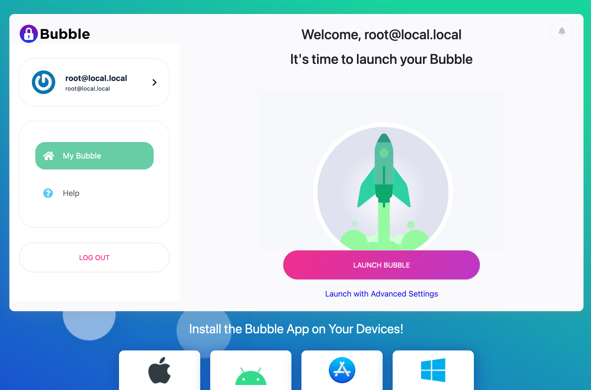
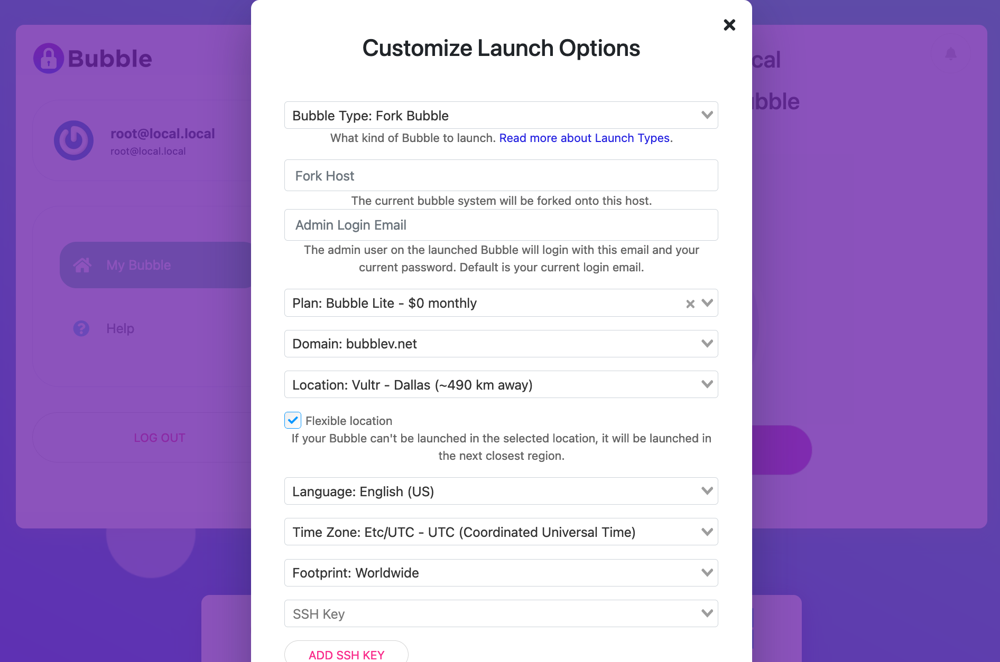

Launching a Bubble from a Remote Launcher
=========================================
These instructions assume you have already set up a [Remote Launcher](remote-launcher.md).

## Create a user
Open a browser window to your Remote Launcher. You should see a screen like this one:

#### Sign In Screen
  

To create a new account, click or tap the "Sign Up" button in the header, or the Sign Up link at the bottom of the screen.

Note: You *could* sign in using the root account and launch a Bubble from there, but this is discouraged for security reasons.
It is *highly recommended* to launch new Bubbles using a regular user account, and not your Remote Launcher root account.
You should use the root account on the Remote Launcher only to manage the system itself.

When you click Sign Up, you'll see a screen like the one below:

#### Sign Up Screen
  

## Verify user
After you create a user, the Remote Launcher will send an email with a verification link.
Click the link in the email to verify your new account.

## Launch Bubble
After you click the verification link in your email, you should see a "Launch Bubble" screen, like the one below:

#### Launch Bubble Screen
  

If you don't want to customize anything, just click or tap the `LAUNCH BUBBLE` button, and you're off and running!

If you like to tweak settings, click the "Launch with Advanced Settings" link below the `LAUNCH BUBBLE` button.
You should now see the advanced launch settings screen, like the one below:

#### Launch Settings Screen
  

Choose your configuration options, then click the "Launch Your Bubble!" button to kick things off.

The screen will refresh and show a progress meter, as in the screenshot below.
A typical launch will take about 10 minutes, but don't fret, there's plenty to do while you wait - read on.

#### Bubble Launching Screen
  

## Your Very First Bubble
The very first Bubble you launch will use a [packer image](packer.md) that was created
during [activation](activation.md).

If the image is still being built or needs to be built, that will add some time to the launch process.

The [Bubble packer documentation](packer.md) has more details on this process. 

## Install Bubble Native Apps
While your Bubble is launching, take a moment to
[install the Bubble Native app](https://support.getbubblenow.com/hc/en-us/articles/360050801634-Connect-a-device-to-your-Bubble)
on each device you plan on connecting to your Bubble.

When your Bubble finishes launching, you'll see something like the screenshot below.
Click or tap "Connect to Bubble" to be connected and automatically logged in to your new Bubble Node.

#### My Bubble Screen
  
