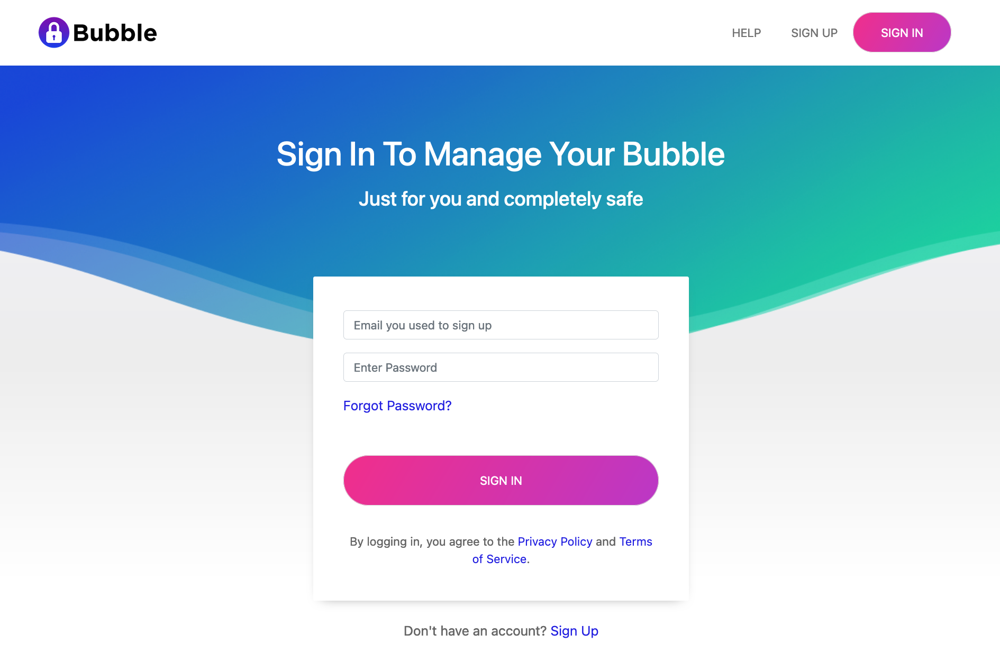
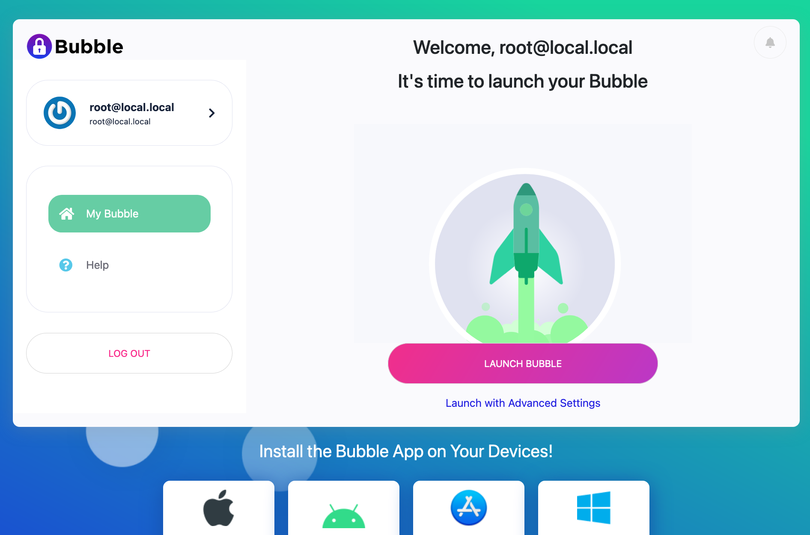
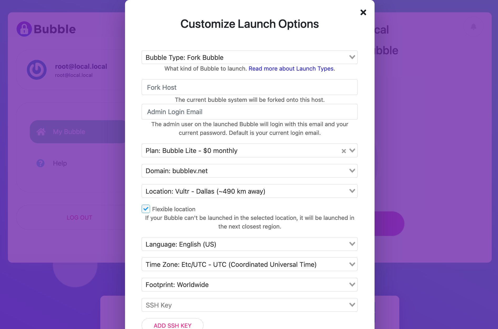

Bubble Remote Launcher Mode
===========================
You must already have a Bubble running in [Local Launcher Mode](local-launcher.md) to proceed.

## Start Bubble
If your Bubble is not already running on your local system, start it by running `./bin/run.sh`

## Log In
When your local Bubble finishes launching, it should open a web page. If you see a page with the title "Activation",
like the one shown below, then your Bubble still needs to be activated.

Read about activation in the [Local Launcher Mode](local-launcher.md) instructions.

#### Activation Screen
  

If you see a login screen (like the one shown below), you should be able to log in as the admin user using the email
address and the password used during activation.

#### Sign In Screen
  

## Fork a Remote Launcher
After you log in, you should see a "Launch Bubble" screen, like the one below:

#### Launch Bubble Screen
  

If you don't see this screen, click the "My Bubble" link in the left sidebar.

Click the "Launch with Advanced Settings" link below the `LAUNCH BUBBLE` button.
You should now see the advanced launch settings screen, like the one below:

#### Launch Settings Screen
   

In the "Bubble Type" drop-down box, ensure "Fork Launcher" is selected.

In the "Fork Host" field, enter the fully-qualified domain name (FQDN) that the Bubble will be known as.
The FQDN has the form `host.net.domain`, where `host` and `net` identify the Bubble and can be whatever you
want (at least 3 characters each), and `domain` is the domain that's been selected in the "Domain" field.

For example, if you selected `example.com` in the "Domain" field, you could enter
`foo.bar.example.com` as the Fork Host.

In the "Plan" field, it is recommended to choose the highest-level plan.
The Remote Launcher requires a decent amount of memory and CPU.

In the "Domain" field, choose the domain that corresponds to the FQDN you entered in the "Fork Host" field.

Configure the remaining fields as you desire. When you're ready, click the "Launch Your Bubble!" button.

The screen will refresh and show a progress meter. A typical launch will take about 10 minutes.

## Your Very Remote Launcher
The very first Bubble Remote Launcher you launch will use a [packer image](packer.md) that was created
during [activation](activation.md).

If the image is still being built or needs to be built, that will add some time to the launch process.

The [Bubble packer documentation](packer.md) has more details on this process. 

## Next Steps
When your Bubble finishes launching, it will show a "Connect to Bubble" button. Click this and you'll be connected
to your Remote Launcher.

You are now ready to [Launch a Bubble](launch-node.md) from the Remote Launcher
